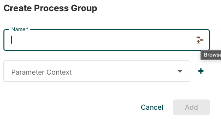
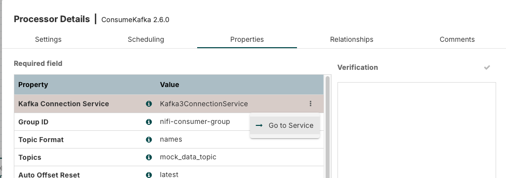
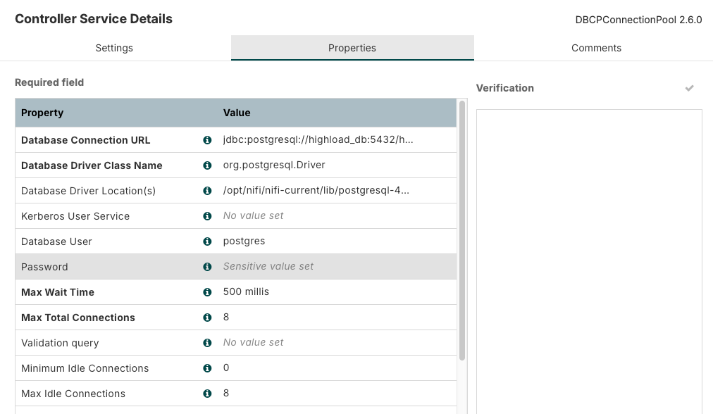
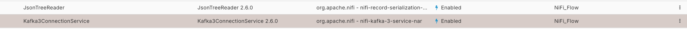
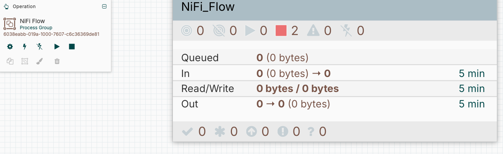

# Запуск

```bash
docker-compose up --build -d zookeeper kafka kafka-ui db nifi metabase
```

# Ждем...☕️ 

# Импортируем схему в NiFi

Заходим [сюда](https://localhost:8443/nifi)

Логинимся

Логин
```
admin
```
Пароль
```
ctsBtRBKHRAx69EqUghvvgEvjnaLjFEB
```

Process Group -> Import -> выбираем этот файл [NiFi_Flow.json](NiFi_Flow.json)



Далее нужно сделать enable всем сервисам


В этом сервисе (DBCPConnectionPool) ставим пароль


```
highload
```


И делаем enable всем


# Запускаем



# Запуск kafka-producer

```bash
docker-compose up --build -d kafka-producer
```
# ~ Пол-минуты - минута - видим в kafke - nifi - postgrese 10k данных -> автоматом создаются отчеты

## _P.S. если вдруг что-то не то - дайте знать - разберемся_

### _P.P.S. пытался сохранить metabase но не получилось, так как во 2–ой лабе делал дашборды в datalens по тем же витринам - можно считать пункт выполненным. Вот как выглядит у меня локально - [metabase_video](https://disk.yandex.ru/i/XUN8ydRYdtgM0Q)_


## Остановка

```bash
docker-compose down
```

# Скрипт с анализом данных
[analys.sql](analys.sql)


# Скрипт по заполнению данных по модели снежинка
[03-DML.sql](init/03-DML.sql)

# Скрипт по созданию отчетов
[04-triggers-mart.sql](init/04-triggers-mart.sql)